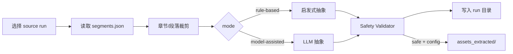

# Asset Extraction Workflow

## 前置条件

- 已完成至少一次翻译 run，存在 `workspace/runs/<run_id>/segments.json`
- `project.yaml` 中 `asset_extraction` 配置已审阅（默认 `enabled: false`）

## 标准流程



## CLI

```bash
# Rule-based（默认，无 API）
python3 scripts/extract_translation_assets.py \
  --source-run run_20260602_203645_draft_stage_b_50ch \
  --chapters 1-5 \
  --mode rule-based \
  --json

# Model-assisted（需 OPENROUTER_API_KEY + REAL_API_TESTS_ENABLED + allow_real_api）
python3 scripts/extract_translation_assets.py \
  --source-run <run_id> \
  --chapters 1-3 \
  --mode model-assisted
```

## 输出产物（每个 run）

```
workspace/asset_extraction_runs/<run_id>/
  extraction_metadata.json
  narrative_assets.jsonl
  game_design_assets.jsonl
  naming_pattern_assets.jsonl
  chapter_structure_assets.jsonl
  abstraction_safety_report.md
  extraction_quality_report.md
```

## 隔离保证

- **不写入** 源 run 的 `draft/`, `refined/`, `final/`, `checkpoint/`, `stage_state`
- **不修改** `segments.json` 内容
- 脚本仅 `read` 源 run，仅 `write` 提取 run 目录

## 测试

```bash
PYTHONPATH=src .venv/bin/pytest tests/test_asset_extraction.py tests/test_asset_safety_validator.py -q
```

## 故障处理

| 现象 | 处理 |
|---|---|
| `source run not found` | 检查 run_id 或完整路径 |
| `no chapters matched` | 调整 `--chapters` 范围 |
| `model-assisted skipped` | 检查 API Key 与 `allow_real_api` |
| 大量 blocked assets | 查看 `abstraction_safety_report.md` |
