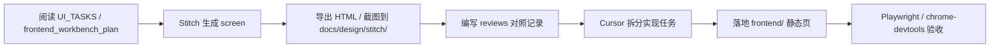

# Stitch 设计工作流

端到端流程：**设计输入 → 任务拆分 → 代码实现 → 浏览器验收**。



## 步骤 1：明确页面目标

从以下文档选取任务：

- `docs/design/stitch/UI_TASKS.md`
- `docs/frontend_workbench_plan.md`
- 当前 Round Prompt（若有前端范围）

记录：页面 ID、用户角色、读取/写入数据、是否与 pipeline 交互。

## 步骤 2：编写 Stitch Prompt

复制 `PROMPT_TEMPLATES.md` 中对应模板，填入：

- 项目类型（小说互译流水线）
- Dark theme 色彩参考
- 中文 UI 文案
- 核心组件与状态（loading / error / empty）

将最终 prompt 存档到 `docs/design/stitch/prompts/`，命名如 `20260606_review_workbench_v1.md`。

## 步骤 3：调用 Stitch MCP

在 Cursor Agent 中（Stitch MCP 可用时）：

1. 创建或选择 Stitch project（建议命名含 `light-novel-workbench`）
2. 调用生成 screen 的工具
3. 获取 HTML 下载链接与截图
4. 可选：生成 variants 对比布局

若 MCP 不可用：在 `governance/round_state.yaml` 或轮次报告记录原因，用模板文字 + 现有 `frontend/` 截图继续。

## 步骤 4：导出与归档

按 [EXPORT_GUIDE.md](./EXPORT_GUIDE.md) 保存：

- HTML → `exports/`
- 截图 → `screenshots/`
- 设计说明 → `exports/*-DESIGN.md` 或 `reviews/`

## 步骤 5：拆分为实现任务

**禁止** 整页复制 Stitch HTML 到 `frontend/`。

应拆分例如：

- 布局：header / sidebar / panel grid
- 组件：segment 列表、术语表、API 状态卡片
- 状态：real_api / mock / dry-run 徽章
- 与现有 `app.js` API 路径对齐

在 `reviews/` 写对照表：Stitch 组件 → 实现文件 → 验收用例。

## 步骤 6：实现（Cursor）

遵守：

- 静态 HTML + 现有 CSS 变量
- 不引入未经批准的前端框架
- API 调用路径与 `src/workbench/` 一致
- 敏感信息脱敏显示

## 步骤 7：浏览器验收

```bash
npm run dev:frontend
npm run test:ui
# 或 Agent 使用 playwright / chrome-devtools MCP
```

验收清单见 `docs/testing/BROWSER_TESTING.md`。

## 角色分工

| Agent | 职责 |
|-------|------|
| Stitch | 设计原型与视觉参考 |
| Cursor | 实现与修复 |
| Codex（用户视角） | 只报问题与改进项，不直接改代码 |
| Playwright MCP | 自动化 smoke 与截图 |

## 与本项目页面映射

| Stitch 任务 | 现有/规划页面 |
|-------------|----------------|
| Dashboard | `frontend/index.html` 项目首页 |
| Review Workbench | `frontend/review.html` |
| Export | `frontend/export.html` |
| Debug Panel | 规划中的可观测性视图（见 UI_TASKS §4） |
