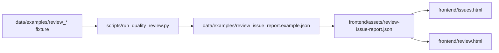

# Quality Review Workbench Wire-up

Round 49 将 deterministic checker 输出与静态 Workbench 对齐，避免 CLI 与 UI 双源。

## 数据流



## 命令

```bash
# 生成/刷新样例报告（仓库内可提交路径）
python3 scripts/run_quality_review.py --write-example

# 同步到 Workbench 静态资源（Round 49 已提交副本；改 fixture 后需手动 cp）
cp data/examples/review_issue_report.example.json frontend/assets/review-issue-report.json

# 可选：写入 gitignore workspace（试跑）
python3 scripts/run_quality_review.py --workspace
```

## 前端

| 页面 | 路径 | 行为 |
|------|------|------|
| Issue Dashboard | `/issues.html` | 列表、severity/type/status 筛选；确认/已解决仅 localStorage |
| Side-by-side | `/review.html` | 加载同一份 report，高亮有 issue 的 segment；`?segment=seg-001` 定位 |

锁定术语类 issue：**无**可用「自动修复」按钮（disabled + title 说明）。

## 状态机

`review_status` 与 `docs/quality_review_workflow.md` 中章节状态一致；有 `LOCKED_TERM_VIOLATION` 时 runner 输出 `term_conflict`。

## Round 50 衔接

见 `docs/round_50_e2e_acceptance_checklist.md`。
