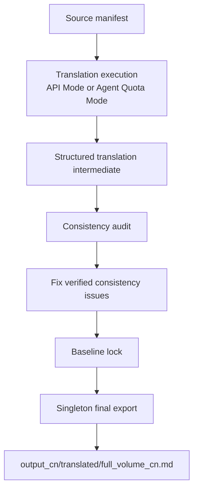

# 翻译流水线设计（v2）

本设计配合 `docs/product_final_state_spec.md` 与 `docs/translation_production_protocol.md` 使用。旧“初译层 → 润色层 → production_candidate”路线已废弃；当前主线是：

```text
翻译执行 -> 一致性校对 -> baseline lock -> singleton final export
```

## 1. 翻译执行层

目标：

- 生成完整、忠实、术语一致的翻译中间态。
- 支持两种合法执行方式：外部 API Mode 与 Agent Quota Mode。
- 输出结构必须一致，不能因为执行方式不同而产生两套流程。

实现要点：

- 输入：source manifest、章节/segment、术语库、角色表、世界观设定、style profile。
- 输出：结构化 segment 文档，包含 `source_text`、`draft_text`、`status`、`execution_mode`、`model_profile` 或 `agent_quota` 记录。
- 真实 API 必须受 cost guard、pause file、orphan worker 检查和用户授权约束。
- Agent Quota Mode 必须写同构产物与报告，不能只把自由文本塞进最终文件。

## 2. 检索与记忆层

目标：

- 为翻译和一致性校对提供术语、人物、世界观、相似句式与已审核译文上下文。
- 只辅助召回，不替代 locked 规则、人工确认或一致性校对。

实现要点：

- Embedding / vector store 可以用于检索，但不能直接决定最终译文。
- 检索输入输出必须带 `project_id`、`language_direction`、source reference 和版本信息。
- 记忆库只收录已审核或明确标注来源的内容，避免污染后续作品。

## 3. 一致性校对层

目标：

- 检查术语、角色称呼、世界观、漏译、多译、格式和章节连续性。
- 只修复可验证问题，不做全书文风润色。

实现要点：

- 使用 `docs/translation_consistency_protocol.md` 作为规则来源。
- 发现冲突时生成 issue / report / patch 建议。
- 修复必须保持 source/baseline 可追溯，不覆盖原文，不自动标记 `human_approved_final`。

## 4. Baseline 与最终导出层

目标：

- 锁定一致性通过后的 baseline。
- 生成唯一最终译文文件，避免多个“最终版本”竞争。

实现要点：

- Canonical final translation：`output_cn/translated/full_volume_cn.md`。
- Manifest：`output_cn/final_export_manifest.json`。
- 最终译文只由 exporter 生成，不由翻译 runner、校对脚本或 UI 直接拼接。
- 辅助导出（双语、报告、资产包）必须标注为辅助产物，不得冒充最终译文。

## 5. 流程图



## 禁止项

- 不启动 refinement / R-MR 作为必经流程。
- 不生成 production_candidate 作为自动化终点。
- 不保留多份互相竞争的最终译文。
- 不在治理轮调用真实 API。
- 不把 API Key、原文正文或长篇真实译文写入报告。
